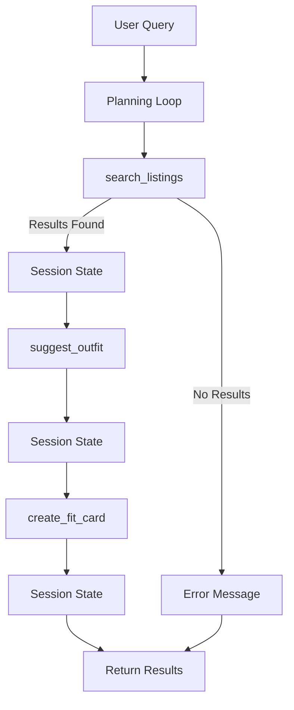

# FitFindr

FitFindr is an AI-powered fashion assistant that helps users discover secondhand clothing, determine how a new item fits into their existing wardrobe, and generate shareable outfit captions. The system uses a multi-tool agent architecture that coordinates search, outfit generation, and content creation through a planning loop.

---

# Project Overview

Shopping secondhand often involves searching across multiple listings, comparing options, and imagining how a piece would work with clothes you already own. FitFindr simplifies this process by combining retrieval, reasoning, and content generation into a single workflow.

The agent accepts a natural language request, searches available listings, selects the most relevant item, generates an outfit recommendation using the user's wardrobe, and creates a social-media-style fit card. The system maintains state between tool calls and handles failure cases gracefully when information is unavailable.

---

# Architecture



---

# Tool Inventory

## 1. search_listings()

### Purpose

Searches the listings dataset for items matching the user's description, size, and budget constraints.

### Inputs

| Parameter   | Type         | Description             |
| ----------- | ------------ | ----------------------- |
| description | str          | User's clothing request |
| size        | str | None   | Desired clothing size   |
| max_price   | float | None | Maximum budget          |

### Returns

```python
list[dict]
```

Each listing contains information such as:

```python
{
    "id": int,
    "title": str,
    "description": str,
    "category": str,
    "style_tags": list[str],
    "size": str,
    "condition": str,
    "price": float,
    "colors": list[str],
    "brand": str,
    "platform": str
}
```

### Example Output

```python
[
    {
        "title": "Faded Band Tee",
        "price": 22,
        "size": "M",
        "platform": "Depop"
    }
]
```

---

## 2. suggest_outfit()

### Purpose

Generates outfit recommendations using the selected listing and the user's wardrobe.

### Inputs

| Parameter | Type | Description        |
| --------- | ---- | ------------------ |
| new_item  | dict | Selected listing   |
| wardrobe  | dict | User wardrobe data |

### Returns

```python
str
```

### Example Output

```text
Pair this faded band tee with your baggy jeans and chunky sneakers for a relaxed vintage streetwear look.
```

---

## 3. create_fit_card()

### Purpose

Creates a short social-media-ready caption based on the outfit recommendation.

### Inputs

| Parameter | Type | Description           |
| --------- | ---- | --------------------- |
| outfit    | str  | Outfit recommendation |
| new_item  | dict | Selected listing      |

### Returns

```python
str
```

### Example Output

```text
Found this vintage band tee on Depop for $22 and it instantly became the centerpiece of my weekend fit 🖤
```

---

# Planning Loop

The agent follows a structured decision-making process rather than blindly calling every tool.

## Step 1: Search

The agent first calls:

```python
search_listings(
    description,
    size,
    max_price
)
```

If no results are found:

```python
results == []
```

The agent stores an error message in session state and immediately stops execution.

---

## Step 2: Select Item

If listings are returned, the agent selects the highest-ranked result:

```python
selected_item = results[0]
```

The selected item is stored in session state.

---

## Step 3: Generate Outfit

The agent calls:

```python
suggest_outfit(
    selected_item,
    wardrobe
)
```

The generated outfit recommendation is stored in session state.

---

## Step 4: Generate Fit Card

The agent calls:

```python
create_fit_card(
    outfit_suggestion,
    selected_item
)
```

The generated fit card is stored in session state.

---

## Step 5: Return Session

The completed session object is returned to the application layer.

---

# State Management Approach

The system maintains state using a shared session dictionary.

```python
session = {
    "selected_item": None,
    "outfit_suggestion": None,
    "fit_card": None,
    "error": None
}
```

## Information Stored

### selected_item

Stores the clothing item selected from search results.

### outfit_suggestion

Stores the outfit recommendation generated by the outfit tool.

### fit_card

Stores the final social-media caption.

### error

Stores any error message encountered during execution.

---

## State Flow

```text
search_listings
    ↓
selected_item
    ↓
suggest_outfit
    ↓
outfit_suggestion
    ↓
create_fit_card
    ↓
fit_card
```

This approach allows tools to share information without requiring the user to repeat inputs.

---

# Error Handling Strategy

The project requires every tool to handle failures gracefully instead of crashing.

## search_listings()

### Failure Scenario

No matching listings are found.

### Example

Query:

```text
designer ballgown
size XXS
under $5
```

Return:

```python
[]
```

Agent Response:

```text
No matching listings found. Try increasing your budget, removing the size filter, or searching for a broader category.
```

The workflow stops and does not proceed to outfit generation.

---

## suggest_outfit()

### Failure Scenario

The user's wardrobe is empty.

### Example

```python
wardrobe["items"] == []
```

Agent Response:

```text
This item works well with relaxed-fit denim, neutral sneakers, and layered outerwear.
```

Instead of failing, the tool generates general styling advice.

---

## create_fit_card()

### Failure Scenario

No outfit recommendation is available.

### Example

```python
outfit == ""
```

Agent Response:

```text
Unable to create a fit card because outfit information is missing.
```

The tool returns a helpful message instead of raising an exception.

---

# Testing

## Tool-Level Testing

Each tool was tested independently before integration.

### search_listings()

Tested:

* valid searches
* empty results
* size filtering
* price filtering

### suggest_outfit()

Tested:

* example wardrobe
* empty wardrobe

### create_fit_card()

Tested:

* valid outfit recommendation
* empty outfit recommendation

---

## Agent-Level Testing

### Happy Path

Verified complete workflow:

```text
Search
↓
Outfit Suggestion
↓
Fit Card
```

### Failure Path

Verified workflow:

```text
Search
↓
No Results
↓
Error Message
↓
Stop Execution
```

Confirmed that later tools are not called when the search step fails.

---

# AI Usage

## Example 1: Implementing search_listings()

### What I Provided

I supplied ChatGPT with:

* Tool specification from planning.md
* Expected inputs and outputs
* Failure mode requirements

### What AI Produced

A Python implementation that:

* loads listings using load_listings()
* filters results
* returns matching listings

### What I Changed

I reviewed the filtering logic, verified price constraints were applied correctly, and tested empty-result behavior before using the generated code.

---

## Example 2: Implementing the Planning Loop

### What I Provided

I supplied ChatGPT with:

* Planning Loop section
* State Management section
* Architecture diagram

### What AI Produced

An implementation of run_agent() that coordinated all three tools.

### What I Changed

I verified:

* state values were stored correctly
* search failures stopped execution
* tools were not called unconditionally

---

# Spec Reflection

## How the Specification Helped

The specification forced me to design tool interfaces, state management, and error handling before implementation. Creating a detailed plan first made development significantly easier because each component already had a defined responsibility.

## Where Implementation Diverged

My original design assumed exact listing matches would usually exist. During implementation I realized searches could frequently return no results, so I spent more time improving user-facing error messages and failure handling than originally planned.

---

# Future Improvements

If I continue developing FitFindr, I would add:

* Price comparison tool
* User style memory across sessions
* Trend awareness from fashion platforms
* Search retry logic with relaxed constraints
* Persistent user profiles

---

# Demo Video Contents

The demo video includes:

1. Complete interaction from user query to fit card
2. Explanation of each tool being called
3. State passing between tools
4. One deliberate failure scenario
5. Discussion of error handling and recovery

---

# Technologies Used

* Python
* Gradio
* Groq API
* Llama 3.3 70B Versatile
* Pytest
* JSON Data Storage

---

# Lessons Learned

This project reinforced that AI applications are more than prompts. Building a useful agent requires reliable tools, clear interfaces, state management, error handling, and a planning loop that adapts to different situations. The most valuable lesson was learning how multiple AI components work together as a system rather than as isolated functions.
