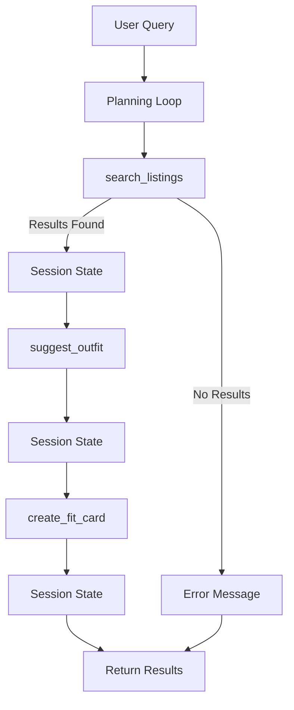

# FitFindr Planning Document

## Project Overview

FitFindr is an AI-powered fashion assistant that helps users discover secondhand clothing items, create outfits using their existing wardrobe, and generate social-media-ready outfit captions. The system uses an agent architecture that coordinates multiple tools through a planning loop. The agent decides which tools to call based on previous results and handles failures gracefully when information is unavailable.

---

# A Complete Interaction

## Example Query

User:

> I'm looking for a vintage graphic tee under $30, size M. I mostly wear baggy jeans and chunky sneakers.

---

## Step 1: Search Listings

Tool Called:

```python
search_listings(
    description="vintage graphic tee",
    size="M",
    max_price=30
)
```

Returns:

```python
[
    {
        "id": 14,
        "title": "Faded Band Tee",
        "price": 22,
        "size": "M",
        "platform": "Depop",
        "condition": "Good"
    }
]
```

Agent Action:

```python
session["selected_item"] = results[0]
```

---

## Step 2: Suggest Outfit

Tool Called:

```python
suggest_outfit(
    new_item=session["selected_item"],
    wardrobe=user_wardrobe
)
```

Returns:

```text
Pair this faded band tee with your baggy jeans and chunky sneakers for a relaxed 90s-inspired look.
```

Agent Action:

```python
session["outfit_suggestion"] = outfit
```

---

## Step 3: Create Fit Card

Tool Called:

```python
create_fit_card(
    outfit=session["outfit_suggestion"],
    new_item=session["selected_item"]
)
```

Returns:

```text
Found this vintage band tee on Depop for $22 and it fits perfectly with my oversized denim rotation 🖤
```

Agent Action:

```python
session["fit_card"] = fit_card
```

---

## Final Output

The user receives:

* Selected item
* Outfit recommendation
* Shareable fit card

---

## Failure Example

User:

> Find a designer ballgown size XXS under $5

Tool Called:

```python
search_listings(
    description="designer ballgown",
    size="XXS",
    max_price=5
)
```

Returns:

```python
[]
```

Agent Action:

```python
session["error"] = (
    "No matching listings found. Try increasing your budget, removing the size filter, or searching for a broader category."
)
```

The agent stops immediately and does not call additional tools.

---

# Tool Specifications

## Tool 1: search_listings

### Purpose

Search the clothing listings dataset using description, size, and price constraints.

### Inputs

```python
description: str
size: str | None
max_price: float | None
```

### Returns

```python
list[dict]
```

Each listing contains:

```python
{
    "id": int,
    "title": str,
    "description": str,
    "category": str,
    "style_tags": list[str],
    "size": str,
    "condition": str,
    "price": float,
    "colors": list[str],
    "brand": str,
    "platform": str
}
```

### Failure Mode

Returns:

```python
[]
```

Agent Response:

```text
No matching listings found. Try adjusting your search criteria.
```

---

## Tool 2: suggest_outfit

### Purpose

Generate outfit suggestions that combine the newly discovered item with pieces already present in the user's wardrobe.

### Inputs

```python
new_item: dict
wardrobe: dict
```

### Returns

```python
str
```

Example:

```text
Pair this graphic tee with your baggy jeans and chunky sneakers for a relaxed vintage streetwear look.
```

### Failure Mode

If wardrobe contains no items:

```python
wardrobe["items"] == []
```

Tool returns general styling advice instead of failing.

Example:

```text
This item works well with relaxed-fit denim, neutral sneakers, and layered outerwear.
```

---

## Tool 3: create_fit_card

### Purpose

Generate a short social-media-style caption based on the outfit recommendation.

### Inputs

```python
outfit: str
new_item: dict
```

### Returns

```python
str
```

Example:

```text
Just thrifted this faded band tee and it instantly became the centerpiece of my weekend fit 🖤
```

### Failure Mode

If outfit recommendation is empty:

```python
outfit == ""
```

Return:

```text
Unable to create a fit card because outfit information is missing.
```

No exception should be raised.

---

# Planning Loop

The agent uses conditional logic to determine which tools should run.

```python
results = search_listings(
    description,
    size,
    max_price
)

if len(results) == 0:
    session["error"] = (
        "No matching listings found. Try adjusting your search criteria."
    )
    return session

selected_item = results[0]
session["selected_item"] = selected_item

outfit = suggest_outfit(
    selected_item,
    wardrobe
)

session["outfit_suggestion"] = outfit

fit_card = create_fit_card(
    outfit,
    selected_item
)

session["fit_card"] = fit_card

return session
```

Decision Rules:

1. Search first.
2. Stop immediately if no results exist.
3. Save selected item to session state.
4. Generate outfit recommendation.
5. Save outfit recommendation to session state.
6. Generate fit card.
7. Return completed session.

---

# State Management

The session dictionary stores information between tool calls.

Example:

```python
session = {
    "selected_item": None,
    "outfit_suggestion": None,
    "fit_card": None,
    "error": None
}
```

State Flow:

```text
search_listings
    ↓
selected_item
    ↓
suggest_outfit
    ↓
outfit_suggestion
    ↓
create_fit_card
    ↓
fit_card
```

Benefits:

* Prevents repeated searches
* Allows tools to share information
* Enables multi-step workflows
* Simplifies debugging

---

# Architecture



---

# Error Handling Strategy

| Tool            | Failure Scenario    | Response                                       |
| --------------- | ------------------- | ---------------------------------------------- |
| search_listings | No matching items   | Return empty list and show actionable guidance |
| suggest_outfit  | Empty wardrobe      | Generate general styling advice                |
| create_fit_card | Empty outfit string | Return descriptive error message               |

Example:

```text
No matching listings found. Try increasing your budget or removing the size filter.
```

---

# AI Tool Plan

## Tool Implementation

### search_listings

AI Tool:

ChatGPT

Input Provided:

* Tool specification
* Function signature
* Failure mode
* Expected return structure

Expected Output:

Python implementation using `load_listings()`.

Verification:

* Returns matching results
* Applies size filter
* Applies price filter
* Returns empty list when appropriate

---

### suggest_outfit

AI Tool:

ChatGPT

Input Provided:

* Tool specification
* Wardrobe schema
* LLM requirements

Expected Output:

Groq-powered implementation that generates outfit suggestions.

Verification:

* Produces outfit recommendations
* Handles empty wardrobe
* Returns string output

---

### create_fit_card

AI Tool:

ChatGPT

Input Provided:

* Tool specification
* Example fit card outputs

Expected Output:

LLM implementation generating short social-style captions.

Verification:

* Returns captions
* Handles missing outfit input
* Produces varied outputs through temperature settings

---

### Planning Loop

AI Tool:

ChatGPT

Input Provided:

* Planning Loop section
* State Management section
* Architecture diagram

Expected Output:

Implementation of run_agent() in agent.py.

Verification:

* Conditional branching exists
* State is stored correctly
* Agent stops after failed search

---

# Stretch Feature Plan

## Retry Logic with Fallback

If no results are found:

1. Retry search without size filter.
2. Inform user that constraints were relaxed.
3. Present new results if available.

Example:

```text
No exact matches found in size M. Showing similar items across all sizes instead.
```

---

# Success Criteria

The project is complete when:

* All three tools function independently.
* All tool failure modes are tested.
* State passes correctly between tools.
* Planning loop branches based on search results.
* Gradio application displays outputs correctly.
* README and demo video explain agent behavior clearly.

```
```
